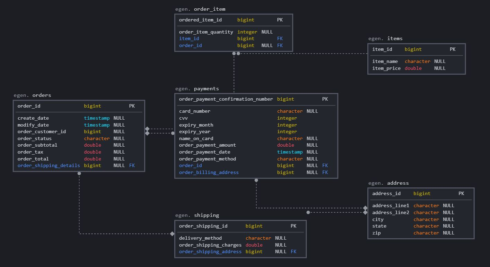

# Egen-ECommerce

A microservices based ECommerce application developed using Java Spring Boot.

## Requirements
* Java 8 or higher
* PostgresSQL 13
* Kafka
* Maven
* SpringBoot
* Docker


## Steps to build the project

Clone this repo and do a maven clean install using the below command. Then use the generated jar to deploy it in any preferred server.

```
 mvn clean package 
```

You can use Docker to build the project using 

```
docker-compose build && docker-compose up
```

## Entity-Relation Diagram



## API details

Swagger documentation can be found at : http://localhost:8080/swagger-ui.html

### 1. Create new Order 

``` 
POST http://localhost:8080/ecommerce/api/order 
```

Sample Request JSON

```
{
    "orderCustomerId": 1005,
    "orderSubtotal":250,
    "orderTax":12,
    "orderTotal":277,
    "orderShippingDetails": {
        "deliveryMethod": "Home delivery",
        "orderShippingCharges":15,
        "orderShippingAddress": {
            "addressLine1": "824 Presedential drive",
            "addressLine2": "Apt 38",
            "city": "Boston",
            "state": "MA",
            "zip": "02111"
        }
    },
    "orderItems": [
        	{
                "itemID": 4,
                "orderItemQuantity": 2
            }
    ],
    "payments":[
    	{
			"orderPaymentMethod":"credit card",
			"orderPaymentAmount":277,
			"orderPaymentDate":"2021-01-12",
			"cardNumber":"1234456778900123",
			"cvv":1234,
			"expiryMonth":6,
			"expiryYear":2022,
			"nameOnCard":"Iron Man",
			"orderBillingAddress": {
	            "addressLine1": "824 Presendential drive",
	            "addressLine2": "Apt 32",
	            "city": "Boston",
	            "state": "MA",
	            "zip": "02111"
        }
    	}
    ]
}

```
Response JSON

```
{
    "orderId": 467,
    "orderStatus": "created",
    "orderCustomerId": 1005,
    "orderSubtotal": 250.0,
    "orderTax": 12.0,
    "orderTotal": 277.0,
    "orderShippingDetails": {
        "orderShippingId": 468,
        "deliveryMethod": "Home delivery",
        "orderShippingCharges": 15.0,
        "orderShippingAddress": {
            "addressLine1": "824 Presedential drive",
            "addressLine2": "Apt 38",
            "city": "Boston",
            "state": "MA",
            "zip": "02111",
            "orderAddressId": 469
        }
    },
    "orderItems": [
        {
            "item": {
                "orderItemPrice": 900.0,
                "orderItemName": "Iphone 12",
                "orderItemId": 4
            },
            "orderItemQuantity": 2,
            "ordereditemId": 470
        }
    ],
    "payment": [
        {
            "orderPaymentConfirmationNumber": 471,
            "orderPaymentMethod": "credit card",
            "orderPaymentAmount": 277.0,
            "orderPaymentDate": "2021-01-12T00:00:00.000+00:00",
            "cardNumber": "1234456778900123",
            "cvv": 1234,
            "expiryMonth": 6,
            "expiryYear": 2022,
            "nameOnCard": "Iron Man",
            "orderBillingAddress": {
                "addressLine1": "824 Presendential drive",
                "addressLine2": "Apt 32",
                "city": "Boston",
                "state": "MA",
                "zip": "02111",
                "orderAddressId": 461
            }
        }
    ],
    "createDate": "2021-04-18T18:40:24.718+00:00",
    "modifyDate": "2021-04-18T18:40:24.718+00:00"
}
```
--

### 2. Get Order by Id

    GET 'localhost:8080/ecommerce/api/order/{order_ID}'
 
Sample Response
 
 ```
 {
    "orderId": 1,
    "orderStatus": "Shipped",
    "orderCustomerId": 1001,
    "orderSubtotal": 1000.0,
    "orderTax": 45.0,
    "orderTotal": 1050.0,
    "orderShippingDetails": {
        "orderShippingId": 102,
        "deliveryMethod": "Home Delivery",
        "orderShippingCharges": 5.0,
        "orderShippingAddress": {
            "addressLine1": "55 Burbank street",
            "addressLine2": "Apt 12",
            "city": "Boston",
            "state": "MA",
            "zip": "02111",
            "orderAddressId": 444
        }
    },
    "orderItems": [
        {
            "item": {
                "orderItemPrice": 1000.0,
                "orderItemName": "Samsung Television",
                "orderItemId": 1
            },
            "orderItemQuantity": 1,
            "ordereditemId": 1
        }
    ],
    "payment": [
        {
            "orderPaymentConfirmationNumber": 1,
            "orderPaymentMethod": "Debit Card",
            "orderPaymentAmount": 1050.0,
            "orderPaymentDate": "2020-01-12T06:00:00.000+00:00",
            "cardNumber": "123123423453456",
            "expiryMonth": 6,
            "expiryYear": 2024,
            "nameOnCard": "Darth Vader",
            "orderBillingAddress": {
                "addressLine1": "30 St.Germain street",
                "addressLine2": "Apt 6",
                "city": "Boston",
                "state": "MA",
                "zip": "02115",
                "orderAddressId": 1
            }
        }
    ],
    "createDate": "2020-01-12T06:00:00.000+00:00",
    "modifyDate": "2021-04-18T18:39:41.943+00:00"
}
```
   
--

### 3. Cancel Order

    PUT 'localhost:8080/ecommerce/api/order/{order_ID}'
         

Sample Response

```
{
    "orderId": 2,
    "orderStatus": "cancelled",
    "orderCustomerId": 1002,
    "orderSubtotal": 985.0,
    "orderTax": 38.0,
    "orderTotal": 1023.0,
    "orderShippingDetails": {
        "orderShippingId": 101,
        "deliveryMethod": "Curb Side Pickup",
        "orderShippingCharges": 0.0,
        "orderShippingAddress": {
            "addressLine1": "1341 Boylston St",
            "addressLine2": null,
            "city": "Boston",
            "state": "MA",
            "zip": "02115",
            "orderAddressId": 4
        }
    },
    "orderItems": [
        {
            "item": {
                "orderItemPrice": 85.0,
                "orderItemId": 3,
                "orderItemName": "Nike Shoes"
            },
            "orderItemQuantity": 1,
            "ordereditemId": 2
        },
        {
            "item": {
                "orderItemPrice": 900.0,
                "orderItemId": 4,
                "orderItemName": "Iphone 12"
            },
            "orderItemQuantity": 1,
            "ordereditemId": 3
        }
    ],
    "payment": [
        {
            "orderPaymentConfirmationNumber": 2,
            "orderPaymentMethod": "Credit Card",
            "orderPaymentAmount": 1023.0,
            "orderPaymentDate": "2020-01-15T06:00:00.000+00:00",
            "cardNumber": "1231231234",
            "expiryMonth": 12,
            "expiryYear": 2022,
            "nameOnCard": "Richie",
            "orderBillingAddress": {
                "addressLine1": "1201 Dulles Ave",
                "addressLine2": "Apt 3103",
                "city": "Stafford",
                "state": "TX",
                "zip": "77477",
                "orderAddressId": 3
            }
        }
    ],
    "createDate": "2020-01-11T06:00:00.000+00:00",
    "modifyDate": "2021-04-19T03:06:51.423+00:00"
}
```

      
## Bulk order creation through Kafka

Bulk orders are processed through Kafka asynchronously.

	POST 'http://localhost:8080/ecommerce/api/order/bulk'

Sample Request JSON

```
[
    {
        "orderCustomerId": 1010,
        "orderSubtotal": 90.0,
        "orderTax": 5.0,
        "orderTotal": 100.0,
        "orderShippingDetails": {
            "orderShippingCharges": 5.0,
            "deliveryMethod": "Home Delivery",
            "orderShippingAddress": {
                "addressLine1": "820 Huntington Ave",
                "addressLine2": "Apt 3",
                "city": "Boston",
                "state": "MA",
                "zip": "02120"
            }
        },
        "orderItems": [
            {
                "itemID": 2,
                "orderItemQuantity": 1
            },
            {
                "itemID": 3,
                "orderItemQuantity": 1
            },
            {
                "itemID": 5,
                "orderItemQuantity": 2
            }
        ],
        "payments": [
            {
                "orderPaymentMethod": "credit card",
                "orderPaymentAmount": 100,
                "orderPaymentDate": "2021-01-12",
                "cardNumber": "1234456778900123",
                "cvv": 1234,
                "expiryMonth": 6,
                "expiryYear": 2022,
                "nameOnCard": "Richie Rich",
                "orderBillingAddress": {
                    "addressLine1": "820 Huntington Ave",
                    "addressLine2": "Apt 5",
                    "city": "Boston",
                    "state": "MA",
                    "zip": "02120"
                }
            }
        ]
    },
    {
        "orderCustomerId": 1022,
        "orderSubtotal": 20699.50,
        "orderTax": 200.25,
        "orderTotal": 21000.0,
        "orderShippingDetails": {
            "orderShippingCharges": 100.25,
            "deliveryMethod": "curbside delivery",
            "orderShippingAddress": {
                "addressLine1": "506 2nd Ave",
                "addressLine2": "Apt 123",
                "city": "Seattle",
                "state": "WA",
                "zip": "98104"
            }
        },
        "orderItems": [
            {
                "itemID": 1,
                "orderItemQuantity": 10
            },
            {
                "itemID": 4,
                "orderItemQuantity": 10
            },
            {
                "itemID": 5,
                "orderItemQuantity": 10
            }
        ],
        "payments": [
            {
                "orderPaymentMethod": "debit card",
                "orderPaymentAmount": 21000,
                "orderPaymentDate": "2021-01-22",
                "cardNumber": "897654213657",
                "cvv": 1234,
                "expiryMonth": 8,
                "expiryYear": 2024,
                "nameOnCard": "Smith Towers",
                "orderBillingAddress": {
                    "addressLine1": "506 2nd Ave",
                    "addressLine2": "Apt 123",
                    "city": "Seattle",
                    "state": "WA",
                    "zip": "98104"
                }
            }
        ]
    },
    {
        "orderCustomerId": 1052,
        "orderSubtotal": 1750.0,
        "orderTax": 50.0,
        "orderTotal": 1800.0,
        "orderShippingDetails": {
            "orderShippingCharges": 0.0,
            "deliveryMethod": "Home delivery",
            "orderShippingAddress": {
                "addressLine1": "824 Presedential drive",
                "addressLine2": "Apt 38",
                "city": "Boston",
                "state": "MA",
                "zip": "02111"
            }
        },
        "orderItems": [
            {
                "itemID": 4,
                "orderItemQuantity": 2
            }
        ],
        "payments": [
            {
                "orderPaymentMethod": "credit card",
                "orderPaymentAmount": 1800,
                "orderPaymentDate": "2021-01-12",
                "cardNumber": "1234456778900123",
                "cvv": 1234,
                "expiryMonth": 6,
                "expiryYear": 2022,
                "nameOnCard": "Iron Man",
                "orderBillingAddress": {
                    "addressLine1": "824 Presendential drive",
                    "addressLine2": "Apt 32",
                    "city": "Boston",
                    "state": "MA",
                    "zip": "02111"
                }
            }
        ]
    }
]
```

Sample Response
	
	Orders successfully queued for creation

The processed requests statuses can be obtained through a different kafka topic or file dump. This feature is not implemented.
	
## Bulk order update through Kafka 

	PUT 'http://localhost:8080/ecommerce/api/order/bulk'
	
Sample Request JSON

```
[
    {
        "orderId": 1,
        "orderStatus": "Shipped",
        "orderCustomerId": 1001,
        "orderSubtotal": 1000.0,
        "orderTax": 45.0,
        "orderTotal": 1050.0,
        "orderShippingDetails": {
            "orderShippingId": 102,
            "deliveryMethod": "Home Delivery",
            "orderShippingCharges": 5.0,
            "orderShippingAddress": {
                "addressLine1": "55 Burbank street",
                "addressLine2": "Apt 12",
                "city": "Boston",
                "state": "MA",
                "zip": "02111",
                "orderAddressId": 2
            }
        },
        "orderItems": [
            {
                "item": {
                    "orderItemName": "Samsung Television",
                    "orderItemId": 1,
                    "orderItemPrice": 1000.0
                },
                "orderItemQuantity": 1,
                "ordereditemId": 1
            }
        ],
        "payment": [
            {
                "orderPaymentConfirmationNumber": 1,
                "orderPaymentMethod": "Debit Card",
                "orderPaymentAmount": 1050.0,
                "orderPaymentDate": "2020-01-12T06:00:00.000+00:00",
                "cardNumber": "123123423453456",
                "cvv": 123,
                "expiryMonth": 6,
                "expiryYear": 2024,
                "nameOnCard": "Darth Vader",
                "orderBillingAddress": {
                    "addressLine1": "30 St.Germain street",
                    "addressLine2": "Apt 6",
                    "city": "Boston",
                    "state": "MA",
                    "zip": "02115",
                    "orderAddressId": 1
                }
            }
        ]
    },
    {
        "orderId": 2,
        "orderStatus": "Ready for pickup",
        "orderCustomerId": 1002,
        "orderSubtotal": 985.0,
        "orderTax": 38.0,
        "orderTotal": 1023.0,
        "orderShippingDetails": {
            "orderShippingId": 101,
            "deliveryMethod": "Curb Side Pickup",
            "orderShippingCharges": 0.0,
            "orderShippingAddress": {
                "addressLine1": "1341 Boylston St",
                "addressLine2": null,
                "city": "Boston",
                "state": "MA",
                "zip": "02115",
                "orderAddressId": 4
            }
        },
        "orderItems": [
            {
                "item": {
                    "orderItemId": 3,
                    "orderItemName": "Nike Shoes",
                    "orderItemPrice": 85.0
                },
                "orderItemQuantity": 1,
                "ordereditemId": 2
            },
            {
                "item": {
                    "orderItemId": 4,
                    "orderItemName": "Iphone 12",
                    "orderItemPrice": 900.0
                },
                "orderItemQuantity": 1,
                "ordereditemId": 3
            }
        ],
        "payment": [
            {
                "orderPaymentConfirmationNumber": 2,
                "orderPaymentMethod": "Credit Card",
                "orderPaymentAmount": 1023.0,
                "orderPaymentDate": "2020-01-15T06:00:00.000+00:00",
                "cardNumber": "1231231234",
                "cvv": 1234,
                "expiryMonth": 12,
                "expiryYear": 2022,
                "nameOnCard": "Richie",
                "orderBillingAddress": {
                    "addressLine1": "1201 Dulles Ave",
                    "addressLine2": "Apt 3103",
                    "city": "Stafford",
                    "state": "TX",
                    "zip": "77477",
                    "orderAddressId": 3
                }
            }
        ]
    }
]
```
Sample Response
	
	Orders successfully queued for updation
	
### NOTE:
The Docker file provided is not tested due to network limitations of my system. It is a standard Docker file that can be used to spin up the required environment.
